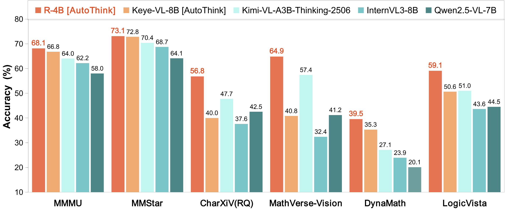
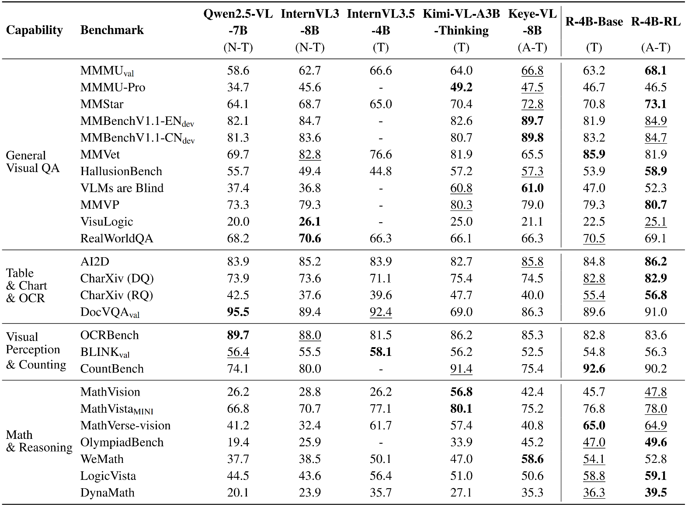

# R-4B: Incentivizing General-Purpose Auto-Thinking Capability in MLLMs via Bi-Mode Annealing and Reinforce Learning

[[📚 Arxiv Paper (Coming soon)](https://huggingface.co/YannQi/R-4B)] [[🤗 Hugging Face](https://huggingface.co/YannQi/R-4B)]  [[🤖️ ModelScope](https://huggingface.co/YannQi/R-4B)] [[💻 Code](https://github.com/yannqi/R-4B)]

<div align="center">
 
</div>

<div align="center">
  
</div>

## ⭐️ Introduction

In this repo, we present **R-4B**, a multimodal large language model designed for general-purpose auto-thinking, autonomously switching between step-by-step thinking and direct response generation based on task complexity. This capability enables R-4B to deliver high-quality responses while significantly improving inference efficiency and reducing computational costs.

The development of R-4B follows a two-stage training paradigm:
(1) Bi-mode Annealing, which establishes both thinking and non-thinking capabilities for VQA; and
(2) Bi-mode Policy Optimization (BPO), which enables the model to adaptively switch between thinking and non-thinking modes based on input demands.

## 🚀 Key Features

- 🧠 **Think Smart, Act Fast: Adaptive & Controllable Thinking!**
  Our model provides three-mode control over the response process.

  - **Auto-thinking Mode:** Unleash **auto-thinking** that works across general topics, from simple Q&A to complex scientific analysis. It saves time and computation by thinking only when it matters.
  - **Support Manual Control:**  Explicitly command the model to use its `thinking` or `non-thinking` capabilities, enabling you to make your choices for every job.
- 🏆  **Strong Performance, Open for Everyone!**
  Our model is now **fully open-source**. It achieves **state-of-the-art performance** among models of comparable size.

## 📢 News

- **[2025.08.20]** 🚀 **vLLM Support is Here!** Our R-4B model is now fully compatible with [vLLM](https://github.com/vllm-project/vllm) for high-performance inference.
- **[2025.08.18]** 🏆 **Top Rank Achieved!** We are thrilled to announce that R-4B is now ranked #1 among all open-source models on the [OpenCompass Multi-modal Reasoning Leaderboard](https://rank.opencompass.org.cn/leaderboard-multimodal-reasoning/?m=REALTIME)!
- **[2025.08.11]** 🥇 **Rank #1!** R-4B ranks first under 20B parameters on the [OpenCompass Multi-modal Academic Leaderboard](https://rank.opencompass.org.cn/leaderboard-multimodal/?m=REALTIME)!
- **[2025.08.05]** 🎉 **R-4B is Released!** Our model is now publicly available. You can download it from [Hugging Face](https://huggingface.co/YannQi/R-4B).

## 🔥 Quickstart

Below, we provide simple examples to show how to use R-4B with 🤗 Transformers.

### Using 🤗 Transformers to Chat

> [!NOTE]
> Users can dynamically control the model's response by selecting one of three modes (`auto-thinking`, `thinking`, or `non-thinking`) with `thinking_mode`. `thinking_mode=auto` for `auto-thinking` mode; `thinking_mode=long` for `thinking` mode; `thinking_mode=short` for `non-thinking` mode.
> Default is `auto-thinking`.

```python
import requests
from PIL import Image
import torch
from transformers import AutoModel, AutoProcessor

model_path = "YannQi/R-4B"

# Load model
model = AutoModel.from_pretrained(
    model_path,
    torch_dtype=torch.float32,
    trust_remote_code=True,
).to("cuda")

# Load processor
processor = AutoProcessor.from_pretrained(model_path, trust_remote_code=True)

# Define conversation messages
messages = [
    {
        "role": "user",
        "content": [
            {
                "type": "image",
                "image": "http://images.cocodataset.org/val2017/000000039769.jpg",
            },
            {"type": "text", "text": "Describe this image."},
        ],
    }
]

# Apply chat template
text = processor.apply_chat_template(
    messages,
    tokenize=False,
    add_generation_prompt=True,
    thinking_mode="auto"
)

# Load image
image_url = "http://images.cocodataset.org/val2017/000000039769.jpg"
image = Image.open(requests.get(image_url, stream=True).raw)

# Process inputs
inputs = processor(
    images=image,
    text=text,
    return_tensors="pt"
).to("cuda")

# Generate output
generated_ids = model.generate(**inputs, max_new_tokens=16384)
output_ids = generated_ids[0][len(inputs.input_ids[0]):]

# Decode output
output_text = processor.decode(
    output_ids,
    skip_special_tokens=True,
    clean_up_tokenization_spaces=False
)

# Print result
print("Auto-Thinking Output:", output_text)
```

</details>

### Using vLLM for fast R-4B deployment and inference.

- We recommend using vLLM for fast R-4B deployment and inference.

#### Install

The code of R-4B requires the newest vllm now. Please install from local source:

```bash
git clone https://github.com/vllm-project/vllm.git
cd vllm
VLLM_USE_PRECOMPILED=1 uv pip install --editable .
```

##### Online Serving

> [!TIP]
> The `thinking_mode` switch is also available in APIs created by [vLLM](https://github.com/vllm-project/vllm). 
> Default is `auto-thinking`.

- Serve

```bash
vllm serve \
    yannqi/R-4B \
    --served-model-name r4b \
    --tensor-parallel-size 8 \
    --gpu-memory-utilization 0.8 \
    --host 0.0.0.0 \
    --port 8000 \
    --trust-remote-code
```

- Openai Chat Completion Client

```python
import base64
from PIL import Image
from openai import OpenAI


# Set OpenAI's API key and API base to use vLLM's API server.
openai_api_key = "EMPTY"
openai_api_base = "http://localhost:8000/v1"

client = OpenAI(
    api_key=openai_api_key,
    base_url=openai_api_base,
)

# image url
image_messages = [
    {
        "role": "user",
        "content": [
            {
                "type": "image_url",
                "image_url": {
                    "url": "http://images.cocodataset.org/val2017/000000039769.jpg"
                },
            },
            {"type": "text", "text": "Describe this image."},
        ],
    },
]


chat_response = client.chat.completions.create(
    model="r4b",
    messages=image_messages,
    max_tokens=16384,
    extra_body={
        "chat_template_kwargs": {"thinking_mode": "auto"},
    },
)
print("Chat response:", chat_response)
```

## 📈 Experimental Results

<div align="center">
  
</div>

1. R-4B establishes itself with powerful, state-of-the-art perceptual abilities that are competitive with larger models.
2. In evaluation sets that require complex logical reasoning and mathematical problem-solving, such as WeMath, MathVerse, and LogicVista, R-4B displays a strong performance curve. This highlights its advanced adaptive thinking capacity for logical deduction and solving complex quantitative problems.

## ✒️ Citation

Coming soon!

## Acknowledgements

R-4B is developed based on the codebases of the following projects: [LLaVA-Next](https://github.com/LLaVA-VL/LLaVA-NeXT), [SigLIP2](https://huggingface.co/google/siglip2-so400m-patch14-384), [Qwen3](https://github.com/QwenLM/Qwen3), [Qwen2.5-VL](https://github.com/QwenLM/Qwen2.5-VL), [VLMEvalKit](https://github.com/open-compass/VLMEvalKit). We sincerely thank these projects for their outstanding work.
